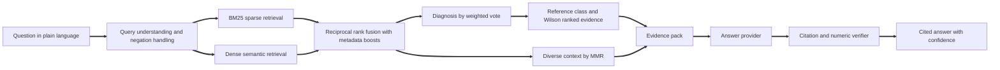
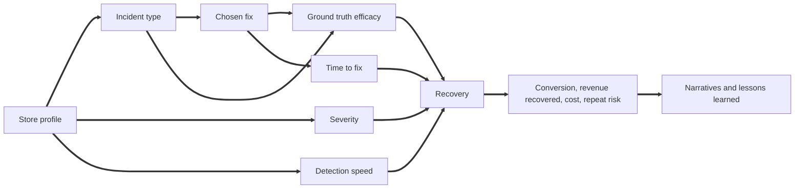

# Tillsmith AI

**Evidence grounded fixes for ecommerce store performance incidents.**

Tillsmith AI is a retrieval augmented generation system for the moment every online retailer dreads: conversion has dropped, revenue is leaking and nobody is sure why. Describe what you are seeing in plain language and Tillsmith diagnoses the incident, finds the most comparable cases among 16,000 historical store incidents, ranks fixes by how often they genuinely recovered conversion, flags the tempting responses that usually make things worse, and writes a cited answer whose every precedent and statistic is verified before it reaches you.

## Project brief

Online stores lose money quietly. A theme update breaks the place order button on one browser, a fraud rule starts declining genuine cards, a new app adds two seconds to every page, a site migration drops thousands of pages from search results. Each of these incidents can cost several days of revenue, and the damage compounds for every hour it goes unnoticed or misdiagnosed. The patterns are well known to experienced ecommerce operators, yet most teams meet each incident as if for the first time, working from dashboards that show the symptom but not the cause.

Under that pressure, teams reach for the responses that feel active rather than the ones that work. The most common reactions to a sudden drop in sales are a sitewide discount or a bigger paid media budget. Both are fast and visible, both spend margin, and neither repairs a broken checkout or a failing payment gateway. General purpose chat assistants do not solve this. They produce fluent, generic advice with no evidence behind it and no sense of which fix is most likely to work for this store on this platform, and they can invent precedents or numbers with complete confidence.

Tillsmith AI was built to close that gap. It treats incident knowledge as data: every case records the store profile, the incident, the root cause, the fix, how quickly it was applied and what happened to conversion, revenue and repeat risk afterwards. Retrieval finds the relevant precedents, a statistical evidence engine decides which fixes to recommend using confidence bounds rather than anecdote, and the language model, when one is used, is confined to explaining that evidence and is checked for fabricated citations and numbers. The result behaves like a senior ecommerce operator who has handled thousands of incidents, remembers exactly how each one ended, and always shows the source.

## What Tillsmith AI does

* **Diagnoses** a messy description into one or more of fifteen incident types, from checkout failure and payment declines to organic visibility loss, even when the wording shares no keywords with the incident base.
* **Understands negation**, so "orders collapsed but traffic looks normal" points at the checkout rather than at traffic quality.
* **Retrieves** the most comparable precedents with a hybrid of BM25 and dense semantic search, fused by reciprocal rank and diversified so the evidence is not a list of near duplicates.
* **Recommends** fixes ranked by the lower bound of a Wilson confidence interval on full recovery, inside a reference class narrowed to your vertical, platform and business model where the data supports it, with the usual owning team, typical cost and revenue recovered.
* **Warns** against fixes whose recovery rate is confidently below baseline, putting the most commonly tried mistakes first.
* **Quantifies** what to expect: typical conversion drop, days of revenue lost at median and P80, detection time, repeat risk, and how much a faster response improves the odds.
* **Profiles** a store before trouble starts, predicting incident exposure with the drivers behind each prediction and a prepared playbook for the incidents it is most likely to face.
* **Verifies** every answer: cited incident IDs must exist in the evidence and every percentage must match a number in the evidence, or the answer is replaced.
* **Exports** its knowledge as fine tuning data so any open model can learn the same grounded behaviour.

## Headline results

Measured by `python tillsmith.py evaluate` on 400 benchmark questions written in phrasing that never appears in the incident narratives, 20 percent of them describing two incidents at once, plus a separate held out bank that was never used for tuning.

<table>
<tr><th>Measure</th><th>Result</th></tr>
<tr><td>Retrieval precision at 10, full hybrid pipeline</td><td>0.956 (BM25 alone 0.825, dense alone 0.836)</td></tr>
<tr><td>Retrieval nDCG at 10, full hybrid pipeline</td><td>0.975</td></tr>
<tr><td>Primary diagnosis accuracy</td><td>97.5%, and 93.3% on the held out phrasing bank</td></tr>
<tr><td>Top recommended fix is genuinely strong</td><td>97.5%, against 61.4% and 75.2% for two naive RAG baselines</td></tr>
<tr><td>Answers recommending a harmful fix</td><td>0.0%</td></tr>
<tr><td>Answers passing citation and numeric verification</td><td>100%</td></tr>
<tr><td>End to end answer latency, cache disabled</td><td>about 5 ms median, under 9 ms p95</td></tr>
<tr><td>Full rebuild from nothing: dataset, index and models</td><td>about 14 seconds on a laptop CPU</td></tr>
</table>

The fix ranking result is the one that matters most commercially. A naive RAG system that retrieves similar incidents and repeats what those teams did inherits their mistakes, because under pressure people often discount or spend on ads instead of fixing the cause. Tillsmith separates *what was done* from *what worked* and picks a genuinely strong fix in almost every case.

## How it works



**1. Query understanding.** The question is normalised with the same tokenizer and stemmer used at index time. Symptoms the user explicitly rules out, such as "traffic is normal" or "fraud has not changed", are removed before anything else happens. A domain thesaurus then detects likely incidents, so "cards are being refused" is recognised as a payment decline spike, and synonym tables pick up vertical, platform and business model context such as "fashion", "Shopify Plus" or "Amazon".

**2. Hybrid retrieval.** BM25 term weights are precomputed per document into a compressed sparse column matrix, so scoring all 16,000 incidents is a single column slice and matrix vector product. The dense model is latent semantic analysis over unigrams and bigrams, reduced to 160 dimensions by truncated SVD. It needs no GPU, no model download and no network. Documents are expanded with the thesaurus of their own incident type, which closes the gap between how incidents are written up and how merchants describe them.

**3. Fusion and boosting.** The two rankings are combined with reciprocal rank fusion. Detected incidents and store context apply soft multiplicative boosts, and caller supplied filters apply hard masks.

**4. Diagnosis.** The top incidents vote for their type, weighted by fused relevance and blended with the thesaurus prior. Up to three incident types are reported, so compound problems such as a migration that broke both search visibility and checkout are handled explicitly.

**5. Evidence engine.** For each diagnosed incident, Tillsmith forms a reference class of every incident of that type and narrows it by vertical, platform and business model only while it keeps at least 200 cases. For every fix used within the class it computes the full recovery rate, the Wilson lower and upper bounds, lift over baseline, repeat rate, median conversion recovery, revenue recovered, days to recover, time to fix and fix cost. Recommendations are ranked by the lower bound. Fixes whose upper bound sits below the baseline go on the avoid list. A timing analysis compares fast and slow responses, and an outlook reports the typical cost of the incident in days of revenue.

**6. Context selection.** Maximal Marginal Relevance picks precedents that are relevant and distinct, and the best documented precedent for each recommended fix is added so every recommendation has a citable example.

**7. Generation and verification.** The evidence is written into a compact evidence pack. The default extractive provider writes the answer deterministically from it. When Claude or a local Ollama model is selected, the model sees only the evidence pack and a strict system prompt. Either way the verifier checks every cited ID and every percentage against the pack, and in strict mode a failing model answer is replaced with the extractive answer.

## The dataset

The incident base is a synthetic dataset of **16,000 store incidents and 54 columns** produced by `tillsmith_ai/generator.py`, a vectorised causal simulator that regenerates the full set in about 1.2 seconds from a fixed seed. Numbers are driven by a causal model and every narrative is composed from the numbers in its own row, so text and fields never disagree.



* **Store profiles** span 12 verticals, 7 platforms, 5 business models, 4 size bands, 4 fulfilment models and 8 regions, with annual online revenue from GBP 59k to over GBP 1bn.
* **Incidents** are drawn from 15 types whose likelihood depends on the profile. Payment declines are more likely with a single payment provider, site speed problems with many apps and image heavy catalogues, search and inventory failures with large catalogues, traffic quality drops with a high share of paid traffic, and tracking breaks with frequent releases and consent rules.
* **Detection** depends on monitoring maturity: the median incident is spotted in about 1.5 hours with advanced monitoring, 8 hours with standard monitoring and 32 hours with basic monitoring.
* **Fixes** are chosen the way real teams choose them. Mature teams pick proven fixes more often, and a share of teams reach for instinctive responses such as a sitewide discount or more paid media.
* **Recovery** depends on the ground truth efficacy of the fix for the incident, monitoring maturity, time to fix, detection lag and severity. Strong fixes fully recover about 64 percent of incidents and harmful ones about 7 percent. Strong fixes are followed by a repeat incident within 90 days 16 percent of the time, against 48 percent for harmful ones, and their median return is about 48 times their cost.

<table>
<tr><th>Column group</th><th>Columns</th></tr>
<tr><td>Store identity</td><td>incident_id, store_name, vertical, business_model, platform, region, store_size_band, fulfilment_model</td></tr>
<tr><td>Store economics and stack</td><td>annual_revenue_gbp, monthly_sessions, average_order_value_gbp, baseline_conversion_rate_pct, mobile_traffic_share_pct, paid_traffic_share_pct, sku_count, app_integration_count, payment_provider_count, release_frequency_per_month, monitoring_maturity</td></tr>
<tr><td>Detection</td><td>detection_date, resolution_date, detection_channel, detection_lag_hours</td></tr>
<tr><td>Incident</td><td>incident_type, severity, affected_funnel_stage, affected_device, root_cause</td></tr>
<tr><td>Impact</td><td>incident_conversion_rate_pct, conversion_retention_ratio, checkout_error_rate_pct, page_load_time_seconds, bounce_rate_pct, cart_abandonment_rate_pct, support_tickets_raised, baseline_daily_revenue_gbp, revenue_at_risk_gbp</td></tr>
<tr><td>Fix</td><td>fix_strategy, team_owner, time_to_fix_hours, engineering_hours, fix_cost_gbp</td></tr>
<tr><td>Outcome</td><td>recovery_status, post_fix_conversion_rate_pct, conversion_recovery_ratio, revenue_recovered_gbp, days_to_recover, return_on_fix, customer_satisfaction, repeat_incident_90d</td></tr>
<tr><td>Narrative</td><td>incident_summary, resolution_narrative, lessons_learned, tags</td></tr>
</table>

The full column reference is in [docs/DATA_DICTIONARY.md](docs/DATA_DICTIONARY.md) and the ground truth efficacy matrix is in [data/ground_truth_efficacy.json](data/ground_truth_efficacy.json). Every numeric value in the dataset is non negative, and dates use the YYYY/MM/DD format.

## Quick start

Requires Python 3.10 or newer.

```bash
python install.py
python tillsmith.py all
python tillsmith.py ask "Checkout conversion collapsed straight after our last release but traffic looks normal. What should we do?"
```

`install.py` installs the requirements with the current interpreter. `tillsmith.py all` generates the dataset, builds the index, trains the risk models, runs the benchmark, checks the house style and runs the test suite.

To add the optional Claude integration:

```bash
python install.py llm
```

To run the API in a container, with the index built into the image:

```bash
docker compose up
```

## Using Tillsmith AI

### Command line

All options are written as `key=value` pairs.

<table>
<tr><th>Command</th><th>Purpose</th></tr>
<tr><td><code>python tillsmith.py ask "question" provider=extractive k=8</code></td><td>Cited answer with diagnosis, ranked fixes, avoid list, timing, outlook and confidence. Add <code>json=1</code> for the full structured result.</td></tr>
<tr><td><code>python tillsmith.py search "query" k=10 mode=hybrid</code></td><td>Most similar incidents. Modes are hybrid, fusion, bm25 and dense.</td></tr>
<tr><td><code>python tillsmith.py recommend incident="Checkout failure" platform=Magento</code></td><td>Evidence table for every fix to a known incident type.</td></tr>
<tr><td><code>python tillsmith.py assess platform=WooCommerce monitoring_maturity=Basic app_integration_count=35</code></td><td>Incident exposure, drivers and playbook for a store profile.</td></tr>
<tr><td><code>python tillsmith.py evaluate queries=400</code></td><td>Benchmark, written to reports/evaluation.json and docs/EVALUATION.md.</td></tr>
<tr><td><code>python tillsmith.py export_sft grounded=1000</code></td><td>Fine tuning data in chat JSONL format.</td></tr>
<tr><td><code>python tillsmith.py serve host=0.0.0.0 port=8000</code></td><td>REST API with interactive documentation at /docs.</td></tr>
<tr><td><code>python tillsmith.py ui</code></td><td>Web interface.</td></tr>
<tr><td><code>python tillsmith.py test</code></td><td>Test suite.</td></tr>
<tr><td><code>python tillsmith.py check_style</code></td><td>Confirms the project contains no hyphen or dash characters.</td></tr>
</table>

### Example answer

Question: *Genuine customers on our Shopify fashion store say their cards are being refused and sales have dropped.*

```text
### Diagnosis
Your situation most closely matches payment decline spike (90% of the weighted evidence).

### Recommended fixes
1. Fraud rule recalibration. Full recovery in 65% of 49 comparable incidents
   (statistical lower bound 51%), against a 35% baseline. Conversion typically
   returned to 99% of baseline in 7 days for a median fix cost of GBP 950.
   Usual owner: payments. Precedent: [INC004195].
2. Payment gateway failover and smart routing. Full recovery in 63% of 59
   comparable incidents (statistical lower bound 50%). Precedent: [INC003011].

### Avoid
Sitewide discount campaign recovered fully in only 6% of 34 comparable incidents.
Paid media spend increase recovered fully in only 6% of 17 comparable incidents.

### Move fast
Incidents resolved within 21 hours of onset fully recovered in 69% of cases,
compared with 59% when resolution took longer.

### What to expect
In this reference class (310 incidents of payment decline spike in Shopify),
conversion typically fell to 71% of baseline.
```

The answer above is abridged. Every answer also carries the outlook in days of revenue, lessons from the closest precedents, a confidence statement, the full evidence tables, the precedent incidents, the verification report and a timing breakdown.

### REST API

<table>
<tr><th>Method and path</th><th>Purpose</th></tr>
<tr><td><code>GET /health</code></td><td>Liveness, incident count and uptime. Never requires a key.</td></tr>
<tr><td><code>POST /ask</code></td><td>Full answer. Body: question, optional filters, k, provider, strict, include_evidence_pack.</td></tr>
<tr><td><code>POST /search</code></td><td>Similar incidents. Body: query, filters, k, mode.</td></tr>
<tr><td><code>POST /recommend</code></td><td>Evidence ranked fixes. Body: incident, vertical, platform, business_model.</td></tr>
<tr><td><code>POST /assess</code></td><td>Incident exposure and playbook for a store profile.</td></tr>
<tr><td><code>GET /incidents/{incident_id}</code></td><td>One incident by ID.</td></tr>
<tr><td><code>GET /stats</code> and <code>GET /options</code></td><td>Incident base statistics and valid filter values.</td></tr>
</table>

```python
import httpx

response = httpx.post(
    "http://localhost:8000/ask",
    json={"question": "Our newsletters are landing in spam folders", "filters": {"platform": "Shopify Plus"}},
    headers={"Authorization": "Bearer your_key"},
)
result = response.json()
print(result["answer"])
print(result["verification"])
```

Set `TILLSMITH_API_KEY` to require the bearer token on every endpoint except health. Responses are gzip compressed, CORS origins are configurable and request bodies are validated with typed schemas.

### Web interface

`python tillsmith.py ui` opens four workspaces:

* **Diagnose**: question, filters and provider choice, the cited answer, headline metrics, evidence tables and charts, expandable precedent incidents and the verification report.
* **Incident explorer**: search the incident base with any retrieval method and read individual incidents.
* **Store risk profile**: profile a store and see predicted exposure, the drivers behind it and a prepared playbook with owning teams.
* **Incident insights**: incident base statistics and a per incident view of which fixes work, optionally within one platform.

## Language model providers

<table>
<tr><th>Provider</th><th>How to enable</th><th>When to use it</th></tr>
<tr><td>extractive</td><td>Default, nothing to configure</td><td>Offline, deterministic, free and instant. The benchmark figures use it.</td></tr>
<tr><td>anthropic</td><td><code>python install.py llm</code>, then set <code>ANTHROPIC_API_KEY</code>, <code>TILLSMITH_LLM_PROVIDER=anthropic</code> and <code>TILLSMITH_MODEL</code> to a Claude model id from the Anthropic documentation</td><td>The most natural, conversational answers over the same evidence.</td></tr>
<tr><td>ollama</td><td>Run Ollama locally, set <code>TILLSMITH_LLM_PROVIDER=ollama</code> and optionally <code>TILLSMITH_MODEL</code></td><td>Fully private deployments where no data may leave the network.</td></tr>
</table>

Model ids are deliberately not hard coded, so upgrading the model is a configuration change. Whichever provider is used, the verifier runs on every answer and strict mode is on by default.

## Configuration

<table>
<tr><th>Variable</th><th>Default</th><th>Meaning</th></tr>
<tr><td>TILLSMITH_LLM_PROVIDER</td><td>extractive</td><td>extractive, anthropic or ollama</td></tr>
<tr><td>TILLSMITH_MODEL</td><td>empty</td><td>Model id for the chosen provider</td></tr>
<tr><td>TILLSMITH_OLLAMA_URL</td><td>http://localhost:11434</td><td>Ollama server address</td></tr>
<tr><td>TILLSMITH_MAX_TOKENS</td><td>1200</td><td>Maximum answer length for model providers</td></tr>
<tr><td>TILLSMITH_API_KEY</td><td>empty</td><td>Enables bearer token authentication on the API</td></tr>
<tr><td>TILLSMITH_CORS</td><td>*</td><td>Comma separated list of allowed origins</td></tr>
<tr><td>TILLSMITH_ROWS and TILLSMITH_SEED</td><td>16000 and 42</td><td>Dataset size and random seed</td></tr>
<tr><td>TILLSMITH_EMBEDDING_DIMS</td><td>160</td><td>Dense embedding dimensions</td></tr>
<tr><td>TILLSMITH_BM25_K1 and TILLSMITH_BM25_B</td><td>1.4 and 0.72</td><td>BM25 saturation and length normalisation</td></tr>
<tr><td>TILLSMITH_RRF_K</td><td>60</td><td>Reciprocal rank fusion constant</td></tr>
<tr><td>TILLSMITH_CANDIDATE_POOL</td><td>400</td><td>Candidates kept from each retriever</td></tr>
<tr><td>TILLSMITH_EVIDENCE_MIN_CASES</td><td>200</td><td>Smallest reference class allowed when narrowing by context</td></tr>
<tr><td>TILLSMITH_CONTEXT_CASES</td><td>8</td><td>Precedents selected by MMR</td></tr>
<tr><td>TILLSMITH_MMR_LAMBDA</td><td>0.72</td><td>Relevance versus diversity balance</td></tr>
<tr><td>TILLSMITH_DATA_DIR, TILLSMITH_ARTIFACT_DIR, TILLSMITH_REPORT_DIR</td><td>data, artifacts, reports</td><td>Storage locations</td></tr>
</table>

## Evaluation

The benchmark scores questions against the generator's ground truth. A retrieved incident counts as relevant when it shares the question's incident type, and scores higher when it also shares the vertical.

<table>
<tr><th>Retrieval method</th><th>Precision at 10</th><th>MRR</th><th>nDCG at 10</th><th>Median latency</th></tr>
<tr><td>BM25 only</td><td>0.825</td><td>0.850</td><td>0.873</td><td>0.8 ms</td></tr>
<tr><td>Dense only</td><td>0.836</td><td>0.878</td><td>0.889</td><td>1.1 ms</td></tr>
<tr><td>Rank fusion only</td><td>0.849</td><td>0.887</td><td>0.898</td><td>1.4 ms</td></tr>
<tr><td>Full hybrid with query understanding</td><td>0.956</td><td>0.977</td><td>0.975</td><td>1.5 ms</td></tr>
</table>

<table>
<tr><th>Fix ranking approach</th><th>Top fix is genuinely strong</th></tr>
<tr><td>Naive RAG, copy the most common fix among similar incidents</td><td>61.4%</td></tr>
<tr><td>Naive RAG, copy the most frequently successful fix</td><td>75.2%</td></tr>
<tr><td>Tillsmith evidence engine</td><td>97.5%</td></tr>
</table>

**Held out phrasing.** A second bank of 30 questions was written after the thesaurus was last tuned and has never been used for tuning. On it, hybrid precision at 10 was 0.930, the primary diagnosis was correct in 93.3% of questions and the top fix was genuinely strong in 93.3%. The small gap to the main benchmark is the honest measure of how well understanding generalises to new wording.

**Avoid list.** 92.3% of fixes on the avoid list are ineffective or harmful by the ground truth. The remainder are moderately effective fixes that are slow to implement, such as a product content enrichment programme, where the data genuinely shows poor outcomes because the damage accumulates while the work is under way.

<table>
<tr><th>Risk model</th><th>Held out result</th></tr>
<tr><td>Incident costs more than five days of revenue</td><td>AUC 0.657 (base rate 32.8%)</td></tr>
<tr><td>Incident undetected for more than 24 hours</td><td>AUC 0.810 (base rate 25.6%)</td></tr>
<tr><td>Incident recurs within 90 days</td><td>AUC 0.616 (base rate 28.3%)</td></tr>
<tr><td>Likely incident classifier, 15 classes</td><td>Top 3 accuracy 32.2% against 6.7% chance for a single guess</td></tr>
</table>

The risk models predict from the store profile alone, before any incident happens. Detection speed is strongly predictable because it depends on monitoring maturity, which is exactly the lever a store controls. Revenue loss and repeat risk depend mostly on how the team responds, which is what the evidence engine addresses. The full report is regenerated by `python tillsmith.py evaluate` into [docs/EVALUATION.md](docs/EVALUATION.md).

## Efficiency

* **No GPU, no model downloads, no vector database.** The whole stack is numpy, scipy, pandas, FastAPI and Streamlit. Artifacts total about 26 MB.
* **Precomputed BM25.** Query scoring is one sparse slice and one product, under a millisecond for 16,000 documents.
* **Dense search as one matrix product.** Queries are folded into the SVD space with a lookup and a small product, then scored against memory mapped float32 embeddings.
* **Partial sorting.** Top k selection uses argpartition instead of full sorts.
* **Vector statistics.** Reference classes, recovery rates and confidence bounds are computed with integer codes and bincount, not loops over rows.
* **Fast cold start.** The engine loads in under a second and several API workers can share the same memory mapped pages.
* **Thread safe LRU cache.** Repeated questions are answered from memory.
* **Measured end to end.** A complete cited answer takes about 5 milliseconds, and a full rebuild of dataset, index and models takes about 14 seconds.

## Reliability and safety

* **Recommendations come from statistics, not from the language model.** The model can only explain evidence the engine selected.
* **Conservative in both directions.** A fix is recommended only when its lower bound is close to or above the baseline, and flagged to avoid only when its upper bound is below the baseline.
* **Verification on every answer.** Citation precision and numeric grounding are computed for each answer and returned with it.
* **Strict mode.** Model answers that fail verification are replaced by the extractive answer, and model outages fall back the same way.
* **Honest confidence.** Each answer states its confidence with reasons. Questions that are not about store performance are recognised and answered without invented advice.
* **Explainable risk.** Every risk prediction lists the factors that raise or lower it.

## Fine tuning data

`python tillsmith.py export_sft` writes chat format JSONL to `data/sft/tillsmith_sft.jsonl` with two record types. Grounded records pair a full evidence pack with a verified cited answer, teaching any open model to answer strictly from retrieved evidence. Case records pair a single incident with its documented fix and lesson, distilling the incident base into the model. A 50 record sample is included at [data/sft_sample.jsonl](data/sft_sample.jsonl).

## Commercial value

* **Online retailers and brands** get an always available incident advisor that cuts time to the right fix and stops margin being burned on discounts and ad spend that do not address the cause.
* **Ecommerce agencies and consultancies** can turn their accumulated client incident history into a differentiating service, answering with evidence from hundreds of comparable stores.
* **Commerce platforms and app marketplaces** can embed the API in merchant dashboards so an alert arrives with a diagnosis and a ranked fix rather than a bare metric.
* **Monitoring and analytics vendors** can pair anomaly detection with evidence based next steps, and use the store risk profile to show merchants where their monitoring gaps are costing money.
* **Payments and fraud providers** can use the payment decline evidence to guide merchants through rule tuning and failover decisions.

The economics are favourable: the default configuration runs on a single small CPU instance with no per query model cost, and the optional model providers can be switched on only where conversational answers add value.

## Using your own incident data

The synthetic dataset demonstrates the system end to end, and the same pipeline accepts real data. Map your incident reviews, alert history, analytics annotations and support records onto the columns in the data dictionary, keep the incident and fix vocabulary in `tillsmith_ai/vocab.py` aligned with your own taxonomy, place the file at `data/tillsmith_incidents.csv` and run `python tillsmith.py build`. The evaluation harness can then be pointed at questions written by your own operators.

## House style

The project follows a strict typographic rule: there is no hyphen or dash character anywhere, not in the data, the documentation, the file names or the source code. Arithmetic uses the operator and numpy function forms, commands use `key=value` options instead of flags, and every piece of text that leaves the system, including model output, passes through a sanitiser. The rule is enforced by `python tillsmith.py check_style` and by the test suite, which caught and blocked a stray minus sign during development.

## Project structure

```text
tillsmith.py                 entry point for every command
install.py                   dependency installer
requirements.txt             core requirements
requirements_llm.txt         optional Claude SDK
Dockerfile and compose.yaml
tillsmith_ai/
    vocab.py                 verticals, platforms, incidents, fixes and the efficacy matrix
    generator.py             vectorised causal dataset generator
    narratives.py            incident, resolution and lesson writers
    schema.py                column documentation
    text.py                  tokenizer and stemmer
    index.py                 BM25 and dense index build and load
    retriever.py             query understanding, negation, fusion, diagnosis and MMR
    evidence.py              reference classes, Wilson ranking, timing and outlook
    risk_model.py            logistic and softmax store risk models
    answer.py                evidence pack and extractive answer writer
    llm.py                   providers and the grounding verifier
    engine.py                orchestration, caching and public operations
    evaluate.py              benchmark harness with a held out bank
    sft.py                   fine tuning export
    api.py                   FastAPI service
    ui_app.py                Streamlit interface
    cli.py                   command line
    style.py                 house style scanner
    config.py and utils.py   settings and shared helpers
data/                        dataset, ground truth and fine tuning sample
docs/                        data dictionary and evaluation report
reports/                     machine readable evaluation results
tests/                       unit and integration tests
```

## Testing

`python tillsmith.py test` runs 50 tests covering dataset shape and integrity, internal consistency between columns, determinism of the generator, the efficacy and monitoring signals, tokenisation, negation handling, context detection, index correctness and speed, filters, fix ranking against the ground truth for every incident type, multi incident diagnosis, off topic handling, verifier behaviour against fabricated citations and numbers, provider failure fallback, every API endpoint including validation and authentication, the evaluation harness including the held out bank, and the house style across the whole project.

## Limitations and roadmap

* The dataset is synthetic. It is realistic in structure and deliberately causal, but figures describe the simulation rather than any real store. Real deployments should rebuild on real incident data.
* The dense model is latent semantic analysis, chosen for speed and zero dependencies. A neural embedding backend would add value for highly varied real world text and fits behind the same interface.
* Planned: connectors for analytics, monitoring and helpdesk tools so incidents open automatically with a diagnosis, incremental index updates, and a feedback loop that records which fixes teams adopted and how they fared.

## License

Released under the MIT License. See [LICENSE](LICENSE).
